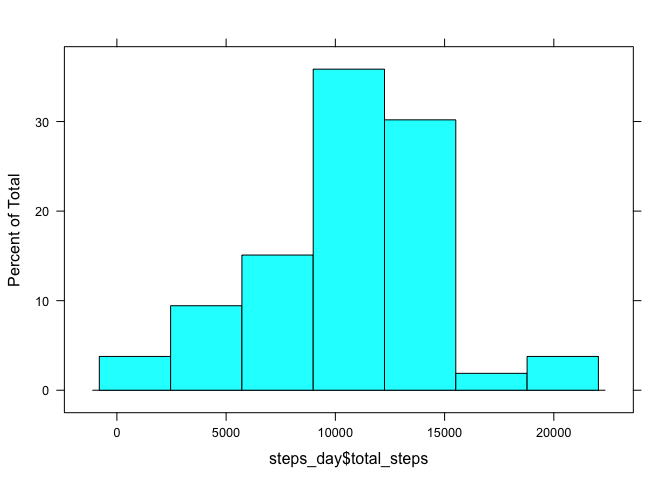
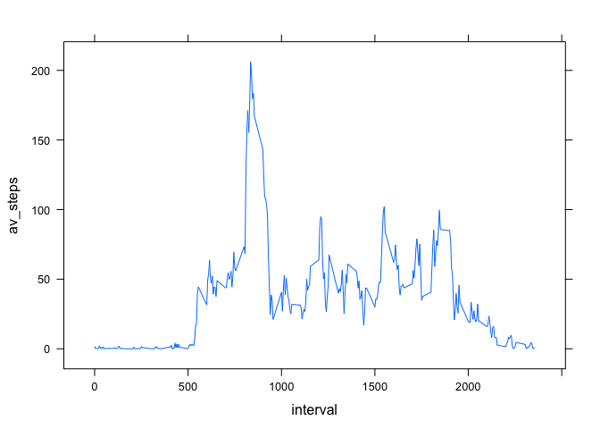
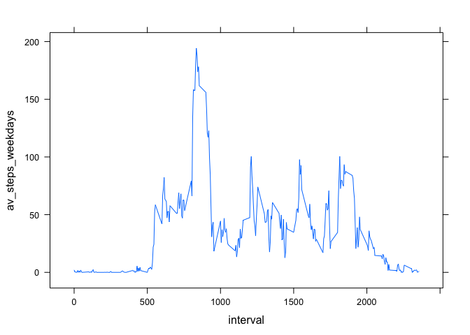
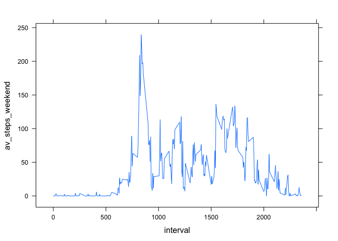

# Reproducible Research: Peer Assessment 1


```r
library(plyr)
library(lattice)
```

### Load the activity data


```r
activity_data <- read.csv('activity.csv',stringsAsFactors = FALSE)
```

The variables included in this dataset are:

* steps: Number of steps taking in a 5-minute interval (missing values are coded as NA)
* date: The date on which the measurement was taken in YYYY-MM-DD format
* interval: Identifier for the 5-minute interval in which measurement was taken


```r
names(activity_data)
```

```
## [1] "steps"    "date"     "interval"
```


```r
summary(activity_data)
```

```
##      steps            date              interval     
##  Min.   :  0.00   Length:17568       Min.   :   0.0  
##  1st Qu.:  0.00   Class :character   1st Qu.: 588.8  
##  Median :  0.00   Mode  :character   Median :1177.5  
##  Mean   : 37.38                      Mean   :1177.5  
##  3rd Qu.: 12.00                      3rd Qu.:1766.2  
##  Max.   :806.00                      Max.   :2355.0  
##  NA's   :2304
```

Process the dataset to remove rows with missing steps measurements, and put the rsult into activty_data_cleaned data frame


```r
activity_data_cleaned <- activity_data[!is.na(activity_data$steps),]
```

### What is mean total number of steps taken per day?


```r
steps_day <- ddply(activity_data_cleaned[c('steps','date')],c('date'),summarize,total_steps=sum(steps))
histogram(~steps_day$total_steps)
```

 

Mean, and median number of steps taken per day 


```r
summary(steps_day$total_steps)
```

```
##    Min. 1st Qu.  Median    Mean 3rd Qu.    Max. 
##      41    8841   10760   10770   13290   21190
```

### What is the average daily activity pattern?

Time series plot of the 5-minute interval (x-axis) and the average number number of steps taken avreaged across all dates shows the daily activity pattern


```r
steps_interval <- ddply(activity_data_cleaned[c('steps','interval')],c('interval'),summarize,av_steps=mean(steps))
xyplot(av_steps ~ interval,data = steps_interval, type='l')
```

 

The interval on which the average activity reaches its peak is between 8 and 9 AM:


```r
steps_interval$interval[which.max(steps_interval$av_steps)]
```

```
## [1] 835
```

### Imputing missing values

Let's see how many rows were omitted when cleaning the data set from the NA values

* Number of rows in the original data set:


```r
nrow(activity_data)
```

```
## [1] 17568
```

* Number of rows in the cleaned data set:


```r
nrow(activity_data_cleaned)
```

```
## [1] 15264
```

* Number of deleted rows:


```r
nrow(activity_data) - nrow(activity_data_cleaned)
```

```
## [1] 2304
```

Would the results be different if the omiited rows would be preserved, and NAs substituted by some artifiially produced values?
Let's fill the missing values with the averages for this given interval


```r
activity_data_proc <- read.csv('activity.csv',stringsAsFactors = FALSE)
for(k in nrow(activity_data_proc)) 
  if(is.na(activity_data_proc[k,]['steps']))
    cur_interval = activity_data_proc[k,]['interval']
    activity_data_proc[k,]['steps'] = steps_interval[steps_interval$interval==cur_interval][1]['av_steps']
```

The histogram, mean, median values for the number of steps taken per day, but produced from the dataset where missing values were substitued:


```r
sim_steps_day <- ddply(activity_data_proc[c('steps','date')],c('date'),summarize,total_steps=sum(steps))
histogram(~sim_steps_day$total_steps)
```

 

```r
summary(sim_steps_day$total_steps)
```

```
##    Min. 1st Qu.  Median    Mean 3rd Qu.    Max.    NA's 
##      41    8841   10760   10770   13290   21190       8
```

The results show that filling up the missing values has not significantly affected the distribution

### Are there differences in activity patterns between weekdays and weekends?

Splitting the data by weekends / weekdays shows that on average level of activity on weekends is higher than on weekdays


```r
is_weekend <- ( weekdays(strptime(activity_data_proc$date,format='%Y-%m-%d')) == 'Saturday' ) | ( weekdays(strptime(activity_data_proc$date,format='%Y-%m-%d')) == 'Sunday' )
                        
weekdays_steps <- ddply(activity_data_cleaned[is_weekend==FALSE,c('steps','interval')],c('interval'),summarize,av_steps_weekdays=mean(steps))
weekends_steps <- ddply(activity_data_cleaned[is_weekend==TRUE,c('steps','interval')],c('interval'),summarize,av_steps_weekend=mean(steps))

xyplot(av_steps_weekdays ~ interval,data = weekdays_steps, type='l')
```

 

```r
xyplot(av_steps_weekend ~ interval,data = weekends_steps, type='l')
```

 
